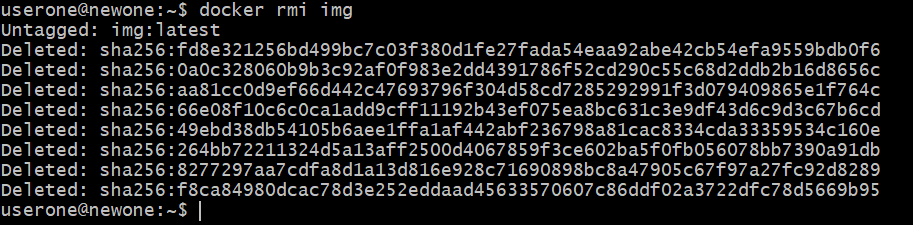

1) docker info
.png>)
which gives the information about the docker images and containers.And shows the details of versions.

2) docker version

which gives the details of the docker version.

3) docker login

it is used to login into the docker hub which is used to pull any images freely.

4) docker logout

it is used to logout from docker hub.

5) docker help

it is used to view the commands which are available in the docker.

6) docker images

it is used to view all the docker images available.

7) docker rmi img

it is used to remove the particular image from our machine.

8) docker pull (image name)

it is used to pull the images from docker hub.

9) docker run -d busybox(image name)

it is used to run the docker image ,if docker images runs then the docker container is created.

10) docker tag busybox fedora/httpd:version1.0
it is used to tag the image with the reference version.

11) docker push fedora/httpd:version1.0

it is used to push docker image into the docker registry.

12) docker history (image name)

to get the details of the image,like when we created,posted,used,etc...

13) docker inspect (image name)

it is used to see the low level information of the image.

14) docker image prune
 
it is used to delete all the unusual docker images.

15) docker ps -a

it is used to list all the containers in the machine.

16) docker ps

it is used to list all the containers which are currently running in the machine.

17) docker start/stop (container name)

start - it is used to start or rerun the container.
stop - it is used to stop the container which is running.

18) docker rm (container name/id)

it is used to remove the stopped container from our machine.

19) docker logs (container name/id)

it is used to view all the logs for particular container.

20) docker exec -it (container is/name) sh

it is used to enter into the container to modify or view specific files in the container.

21) docker inspect (container id)

it is used to view the low level information of the container.

22) docker export (container name) > (tar file name)

it is used to export the container into a tar file.

23) docker network ls

it is used to view all the networks available in our docker machine.

24) docker network create (network name)

it is used to create a network.

25) docker network rm (network name)

it is used to remove the network.

26) docker network inspect (network name)

it is used to view all the information about network and all the containers connected to that network.

27) docker volume ls

it is used to view all the volumes created in the machine.

28) docker volume create (vol name)

it is used to create a new volume.

29) docker volume inspect (vol name)

it is used to view the low level information of the volume.

30) docker volume rm (vol name)

it is used to remove the volume from the docker machine.

31) docker system prune --volumes

it is used to remove all the unused volumes in the docker machine.

32) docker-compose --version

it is used to check the version of the compose.

33) yaml file creation for compose

we create a yaml file and write the yaml file.
in dockercompose.yaml file we write the services which we are going to use.

34) docker-compose up -d

it will use the docker-compose.yaml file .to start the containers according to the services in the manifest file .

35) docker-compose down

whatever the container created by docker compose,if i want to stop and remove the then we use docker-compose down command.

36) docker-compose ps

it is used to view all the running containers by docker-compose.

37) docker-compose images

it is used to view the images used by docker-compose.

38) docker-compose stop
 
it is used to stop the container which is created by docker-compose.

39) docker-compose start

it is used to start or rerun the stopped container.

40) docker swarm init

it is used to initialize the docker cluster as a master node.

41) docker swarm join-token worker

it is used to generate a token which is used to join the worker node into this swarm.

42) docker swarm join --token (token)
it is used in worker machine to join as a worker node.

43) docker service create --name (service name) -p 8080:8080(port mapping) (image name)

it is used to create a service with an docker image.

44) docker service ls

it is used to list all the services which are available in the machine.

45) docker service ps (service name)

it is used to list all the task assigned to one or more services.

46) docker service logs (service name)

it fetches the logs of a service or task.

47) docker service inspect (service name)

it is used to display the low level information of the service.

48) docker service update --replicas=3(no.of replicas) sample(service name)

it is used to update a service.

49) docker service scale sample(service name)=3(no.of replicas)

it is used to scale one or multiple replicated services.

50) docker service rollback (service name)

it is used to revert changes to a service configuration.

51) docker service rm sample(service name)

it is used to remove the service created in the machine.

